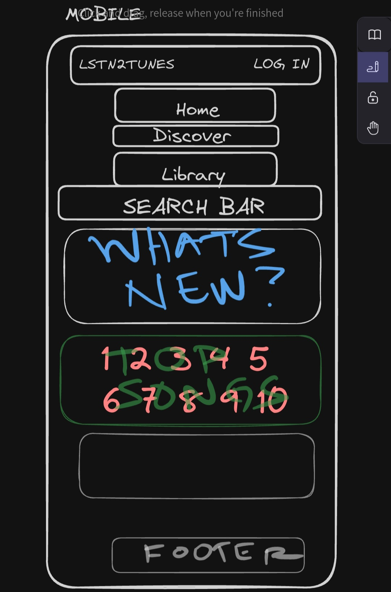
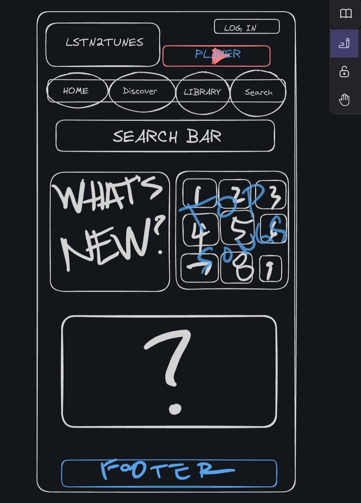
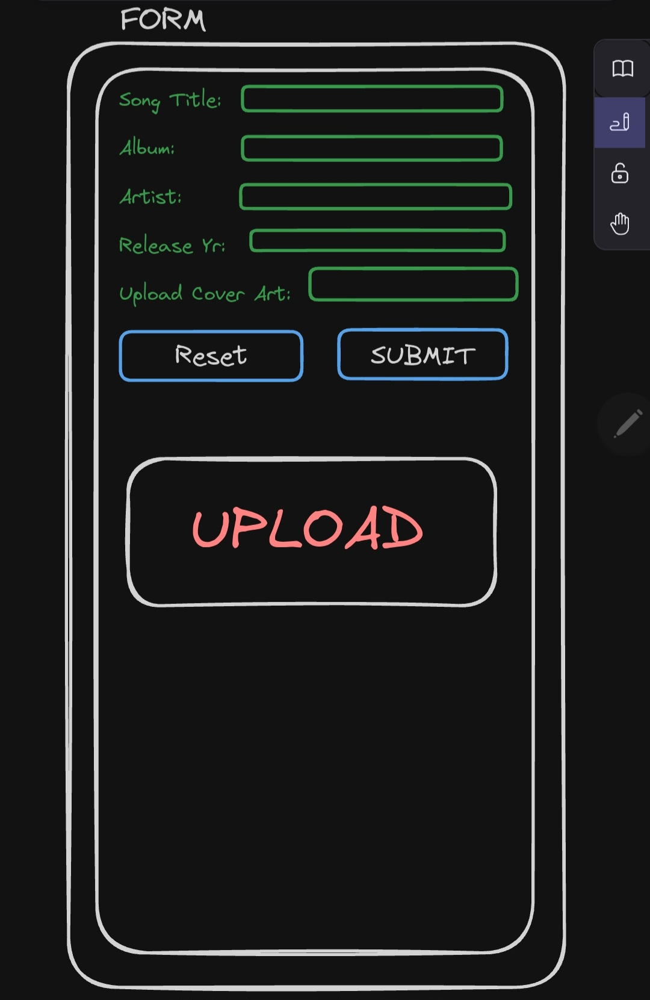

# App Planning Lab

## Getting Started

1. Fork and clone this repository.

1. Answer the questions below by editing this readme. Leave the questions and prompts, and answer in between them. Make sure when you read back your work that you've written things clearly, so that anyone reading it can easily understand what you've written.

1. Where applicable add screenshots, photos, and links.

1. You will also deploy an `index.html` page to GitHub pages.

## Instructions

You will be planning a new application to develop that will be a competitor for another popular application. Your goal is to determine the minimal functionality required so you can launch your app as soon as possible.

Choose from any popular app. It can be an app for anything:

- Music
- TV/Videos
- Shopping
- Social media
- Blog
- Forum (like Stack Overflow or Reddit)
- Chat app
- Recipes
- Business reviews

## Questions

## Project Managing Tool

#### In 1-3 sentences describe your application.

My app is a music discovery and sharing platform called "Listen2Tunes" that allows users to discover, listen to, and share their favorite music with friends and the music community.

#### What is the name of your application?

LSTN2TUNES

#### Create a minimum of 10 user stories. Make sure to use the format:

- `As a <type of user>, I want to <some goal>, so that <some reason>.`

Write the user stories below. Add more `>` for each user story or use `-` to make a list

As a music enthusiast, I want to create a profile, so that I can share my musical tastes and preferences with others.
As a user, I want to browse music genres, so that I can discover new music that aligns with my interests.
As a music lover, I want to create and manage playlists, so that I can curate my favorite tracks in one place.
As a user, I want to listen to full tracks, so that I can enjoy the music offered on the platform.
As a music enthusiast, I want to follow my favorite artists, so that I can stay updated on their latest releases and updates.
As a user, I want to like and comment on songs, so that I can engage with the music community.
As a music creator, I want to upload my original tracks, so that I can share my music with a wider audience.
As a user, I want to collaborate with other artists, so that I can create and share music together.
As a user, I want to receive personalized music recommendations, so that I can discover new music I might enjoy.
As a music enthusiast, I want to share music on social media, so that I can introduce my friends to great tunes.

#### Create a new board

Follow the format provided (name of board, the 5 lists etc.) in the reading.

- Add a minimum of 5 cards (front only) based on your user stories to `Backlog`.
- Add appropriate labels.

Provide a link to your board below.

> [https://trello.com/invite/b/sOLRlZ4U/ATTI54379b1c39341fd7015098446290fcd90365EC98/lstn2tunes]()

#### For one card, fill out more details, include:

- The business case
- Acceptance criteria
- Notes
- Resources

Move that card to the `Doing` list and assign yourself to it.

Provide a link to the specific card below.

> [https://trello.com/c/DjlPUhab]()

#### Create one bug card.

Think back to a bug you had in a recent lab or project and do your best to model that example.
It can either be a bug you solved or that you didn't get a chance to solve.

It should include:

- A brief description of the bug.
- The expected behavior.
- The steps to reproduce.
- At least one resource.

Make sure to label it as a bug. Move the card to the `To Do` list.

Provide a link to the specific card below.

> [https://trello.com/c/d9wOeKo8]()

#### Create one chore card

Think back to a chore you had in a recent lab or project and model that example. Move the chore to the `Done` column.

- Assign yourself to it.
- Add a due date.

Provide a link to the specific card below. (remember to add the link, without quotes, in the README.md inside the parenthesis)

> [https://trello.com/c/ftfFgWj8]()

### Wireframes

Create three wireframes. You may use a free online tool or draw them on paper (you can either scan them or use your phone to photograph them). You will upload them to this repository and save the images in the assets folder. For each link below add the url to the parenthesis. No quotes needed in the url address.

**Create a mobile wireframe for the landing page view.**

**Create a landing page wireframe for a wide desktop view.**

**Create a wireframe for a form (new user, new shipping information, new post, new song, new product etc.) view. (mobile or desktop)**

## Reflection

Write down three things that went well for you doing this lab.

- I was able to create clear and detailed user stories for the music app.
- Setting up the Trello board with user stories, bug cards, and chores was straightforward.
- Designing wireframes for the app's different views helped me visualize the layout.

Write down one thing you'd improve on for next time.

I need to work on estimating the time required for different tasks better, as I encountered some delays during the card creation process.

Please list out your Team Members if you worked on a team:

1.

## Bonus:

### Minimum Viable Product

Create an `index.html` file and a `styles.css` file. Using your user stories and wireframes build the responsive `index` view. You should use `lorem ipsum` placeholder text and placeholder images, where applicable. The index view should have between 2 and 5 example resources.

Deploy this to GitHub pages.
