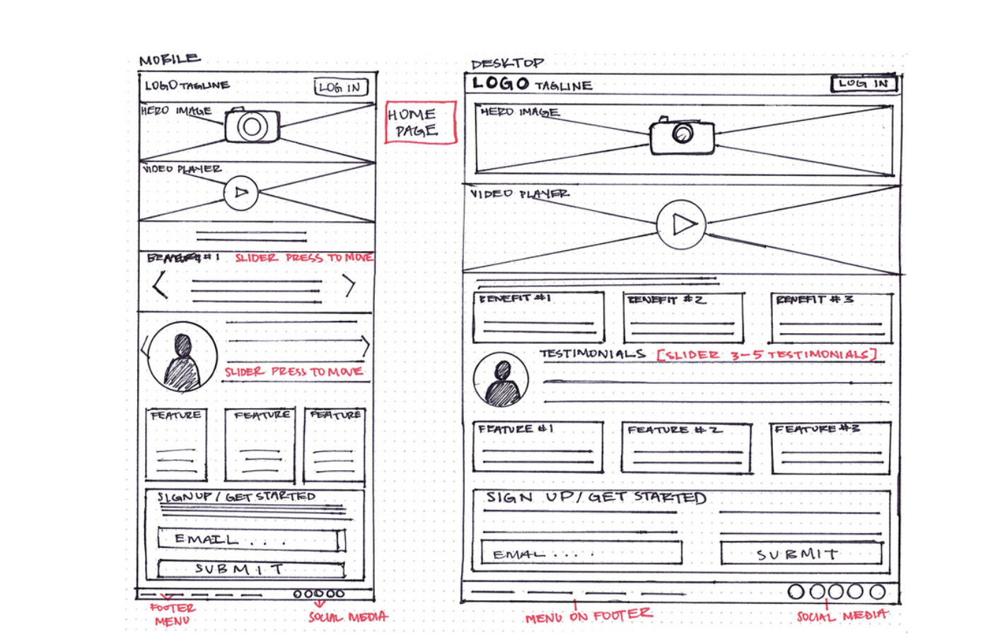

# App Planning Lab

## Getting Started

1. Fork and clone this repository.

1. Answer the questions below by editing this readme. Leave the questions and prompts, and answer in between them. Make sure when you read back your work that you've written things clearly, so that anyone reading it can easily understand what you've written.

1. Where applicable add screenshots, photos, and links.

1. You will also deploy an `index.html` page to GitHub pages.

## Instructions

You will be planning a new application to develop that will be a competitor for another popular application. Your goal is to determine the minimal functionality required so you can launch your app as soon as possible.

Choose from any popular app. It can be an app for anything:

- Music
- TV/Videos
- Shopping
- Social media
- Blog
- Forum (like Stack Overflow or Reddit)
- Chat app
- Recipes
- Business reviews

## Questions

## Project Managing Tool

#### In 1-3 sentences describe your application.

> My app lets people find and share recipes from all over the world.

#### What is the name of your application?

> Recipedia

#### Create a minimum of 10 user stories. Make sure to use the format:

- `As a <type of user>, I want to <some goal>, so that <some reason>.`

Write the user stories below. Add more `>` for each user story or use `-` to make a list

>- As a user, I want to create an account, so that I have access to others' recipes and a place to keep my recipes.
>- As a user, I want to share recipes from my culture, so that others can enjoy our food.
>- As a user, I'd like to save recipes to my recipe book.
>- As a user, I want to be able to post pictures of foods I made.
>- As a user, I want to accurately translate foreign recipes to a language I understand.
>- As a user, I'd like the ability to delete recipes from my recipe book.
>- As a user, I want to be able to edit my copy of a saved recipe.
>- As a user, I'd like the ability to provide feedback for others' recipes (ratings, comments, etc...).
>- As a user, I want to be able to maintain a list of favorite recipes from other users.
>- As a user, I'd like to filter recipes by country, ingredients, etc...

#### Create a new board

Follow the format provided (name of board, the 5 lists etc.) in the reading.

- Add a minimum of 5 cards (front only) based on your user stories to `Backlog`.
- Add appropriate labels.

Provide a link to your board below.

> [Recipedia board](https://trello.com/b/EPHIuqjb/recipedia)

#### For one card, fill out more details, include:

- The business case
- Acceptance criteria
- Notes
- Resources

Move that card to the `Doing` list and assign yourself to it.

Provide a link to the specific card below.

> [Detailed card](https://trello.com/c/fhma0QhK)

#### Create one bug card.

Think back to a bug you had in a recent lab or project and do your best to model that example.
It can either be a bug you solved or that you didn't get a chance to solve.

It should include:

- A brief description of the bug.
- The expected behavior.
- The steps to reproduce.
- At least one resource.

Make sure to label it as a bug. Move the card to the `To Do` list.

Provide a link to the specific card below.

> [Bug card](https://trello.com/c/IKWZSidk)

#### Create one chore card

Think back to a chore you had in a recent lab or project and model that example. Move the chore to the `Done` column.

- Assign yourself to it.
- Add a due date.

Provide a link to the specific card below. (remember to add the link, without quotes, in the README.md inside the parenthesis)

> [Chore card](https://trello.com/c/XbW7EvUV)

### Wireframes

Create three wireframes. You may use a free online tool or draw them on paper (you can either scan them or use your phone to photograph them). You will upload them to this repository and save the images in the assets folder. For each link below add the url to the parenthesis. No quotes needed in the url address.

**Create a mobile wireframe for the landing page view.**

[My Mobile Landing Page Wireframe Link](./assets/landing-page-mobile.jpeg)

**Create a landing page wireframe for a wide desktop view.**

[My Desktop Main Page Wireframe Link](./assets/landing-page-desktop.jpeg)

**Create a wireframe for a form (new user, new shipping information, new post, new song, new product etc.) view. (mobile or desktop)**

[My Form Wireframe Link](./assets/form.jpeg)

## Reflection

Write down three things that went well for you doing this lab.

>- Adding new lists
>- Adding cards to the lists
>- Moving cards to different lists

Write down one thing you'd improve on for next time.

> One thing I'd improve would be my descriptions on the cards.

Please list out your Team Members if you worked on a team:

1. Just me

## Bonus:

### Minimum Viable Product

Create an `index.html` file and a `styles.css` file. Using your user stories and wireframes build the responsive `index` view. You should use `lorem ipsum` placeholder text and placeholder images, where applicable. The index view should have between 2 and 5 example resources.

Deploy this to GitHub pages.
